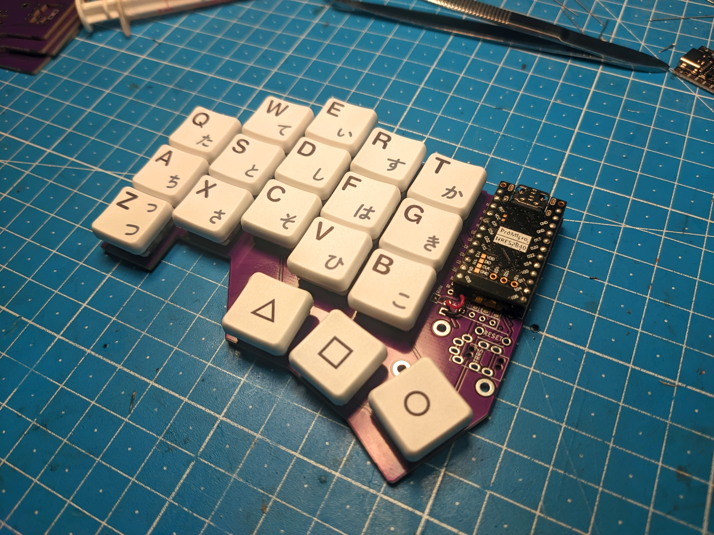

# minifi

Fork of the [chocofi](https://github.com/pashutk/chocofi) for Choc Mini (PG1232) through-PCB switches.

Otherwise basically the same as the chocofi, except I'm pretty sure the case won't fit this anymore. (I haven't tested it though)

# Artifacts

Gerbers are in the [GitHub releases](https://github.com/Rouji/minifi/releases)

# Firmware

The chocofi is wired like a corne, and uses firmware built for the "corne" shield (at least for ZMK).  
Though re-routed, wiring is identical to the chocofi, so you building firmware for this is the same.  

**Note:** The corne has an extra pinky column, so you need to write your keymap as if those columns were there, and they just get ignored. 

# By the way

Recommended batteries:

- [Nice nano docs](https://nicekeyboards.com/docs/nice-nano/#recommended-batteries-and-sockets) explains some basics
- [nRFmicro wiki](https://github.com/joric/nrfmicro/wiki/Batteries#301230) contains links to Aliexpress
